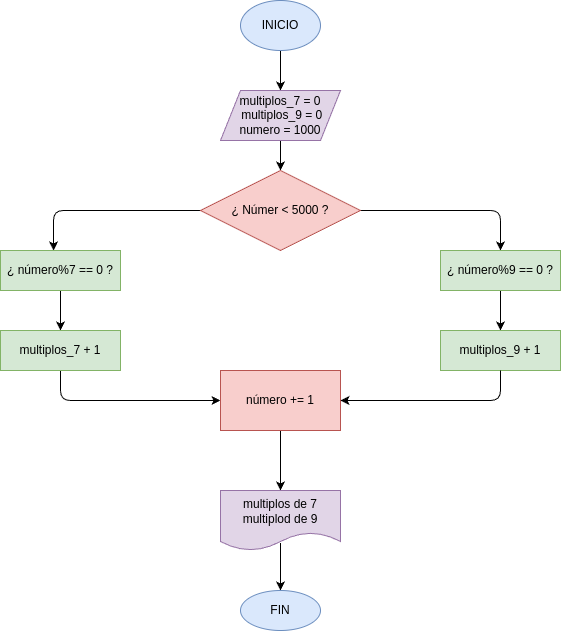

# MULTIPLOS DE 7 Y 9 
Hacer el diagrama de flujo y el programa en python, que averigue e imprima cuantos multiplos 7 de y cuantos multiplos de 9 hay en los números comprendidios entre 1000 y 5000

## DISEÑO 
