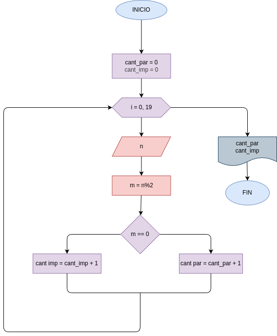

# comparar_pares_impares
Programa en python para comparar números pares e impares

## Diseño 

2. Hacer el diagrama de flujo y el programa en python, que averigue e imprima cuantos multiplos 7 de y cuantos multiplos de 9 hay en los números comprendidios entre 1000 y 5000
